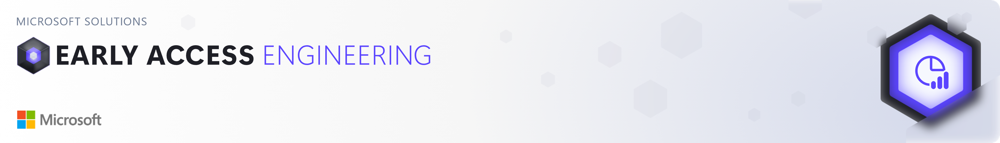
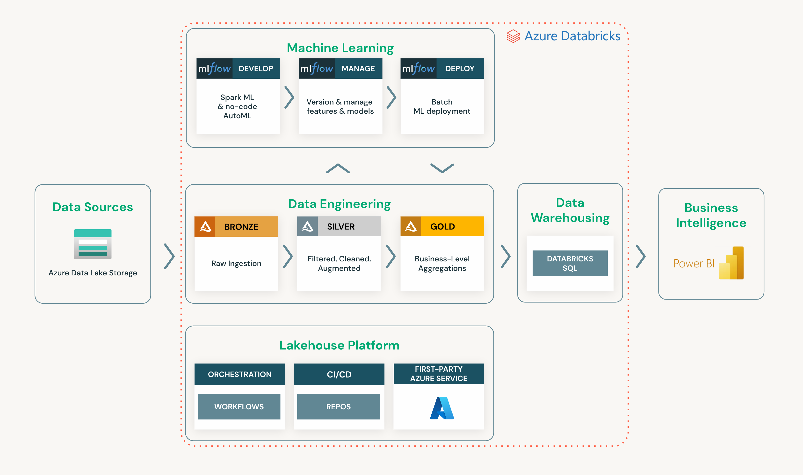

# Azure Databricks Solution Accelerator for Financial Analytics of Customer Revenue Growth Factor
This solution accelerator was built to provide developers with all of the resources needed to build a solution to identify the top factors for revenue growth from an e-commerce platform using Azure Databricks.

## Getting Started
* **Don't have an existing Azure Databricks Workspace:** Azure Databricks is a first-party Azure solution. You can easily deploy a new Azure Databricks workspace using the Azure Portal by following these [instructions](https://learn.microsoft.com/en-us/azure/databricks/scenarios/quickstart-create-databricks-workspace-portal?tabs=azure-portal#create-an-azure-databricks-workspace). Once the workspace is deployed you can continue with the [Setup Guide](./setup/setup_guide.md)
* **Have an existing Azure Databricks Workspace:** continue to the [Setup Guide](./setup/setup_guide.md).

## Prerequisites
In order to successfully complete your solution, you will need to have access to and or provisioned the following:
1. Access to an Azure subscription
2. A Power BI Pro License (or free trial)

## Azure and Analytics Platform
The directions provided for this repository assume fundamental working knowledge of Azure, Azure Databricks, and Power BI.

For additional training and support, please see:
 1. [Azure Databricks](https://azure.microsoft.com/en-us/products/databricks/)
 3. [Power BI](https://docs.microsoft.com/en-us/power-bi/)

## Process Overview  

The architecture diagram below details what you will be building for this Solution Accelerator:

## License
Copyright (c) Microsoft Corporation

All rights reserved.

MIT License

Permission is hereby granted, free of charge, to any person obtaining a copy of this software and associated documentation files (the ""Software""), to deal in the Software without restriction, including without limitation the rights to use, copy, modify, merge, publish, distribute, sublicense, and/or sell copies of the Software, and to permit persons to whom the Software is furnished to do so, subject to the following conditions:

The above copyright notice and this permission notice shall be included in all copies or substantial portions of the Software.

THE SOFTWARE IS PROVIDED AS IS, WITHOUT WARRANTY OF ANY KIND, EXPRESS OR IMPLIED, INCLUDING BUT NOT LIMITED TO THE WARRANTIES OF MERCHANTABILITY, FITNESS FOR A PARTICULAR PURPOSE AND NONINFRINGEMENT. IN NO EVENT SHALL THE AUTHORS OR COPYRIGHT HOLDERS BE LIABLE FOR ANY CLAIM, DAMAGES OR OTHER LIABILITY, WHETHER IN AN ACTION OF CONTRACT, TORT OR OTHERWISE, ARISING FROM, OUT OF OR IN CONNECTION WITH THE SOFTWARE OR THE USE OR OTHER DEALINGS IN THE SOFTWARE

## Note about Libraries with MPL-2.0 License

The following libraries are not explicitly included in this repository, but users who use this Solution Accelerator may need to install them locally and in Azure Databricks to fully utilize this Solution Accelerator. However, the actual binaries and files associated with the libraries are not included as part of this repository, but they are available for installation via the PyPI library using the pip installation tool.  
  
Libraries: certifi

## Contributing

This project welcomes contributions and suggestions.  Most contributions require you to agree to a Contributor License Agreement (CLA) declaring that you have the right to, and actually do, grant us the rights to use your contribution. For details, visit https://cla.opensource.microsoft.com.

When you submit a pull request, a CLA bot will automatically determine whether you need to provide a CLA and decorate the PR appropriately (e.g., status check, comment). Simply follow the instructions provided by the bot. You will only need to do this once across all repos using our CLA.

This project has adopted the [Microsoft Open Source Code of Conduct](https://opensource.microsoft.com/codeofconduct/). For more information see the [Code of Conduct FAQ](https://opensource.microsoft.com/codeofconduct/faq/) or contact [opencode@microsoft.com](mailto:opencode@microsoft.com) with any additional questions or comments.

## Trademarks

This project may contain trademarks or logos for projects, products, or services. Authorized use of Microsoft trademarks or logos is subject to and must follow [Microsoft's Trademark & Brand Guidelines](https://www.microsoft.com/en-us/legal/intellectualproperty/trademarks/usage/general). Use of Microsoft trademarks or logos in modified versions of this project must not cause confusion or imply Microsoft sponsorship. Any use of third-party trademarks or logos are subject to those third-party's policies.
