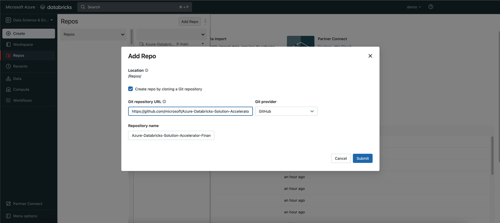
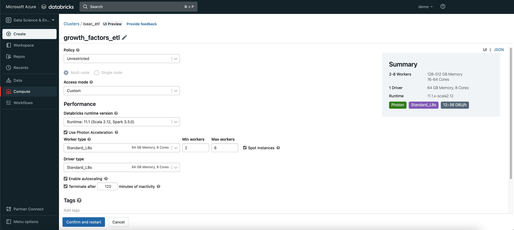
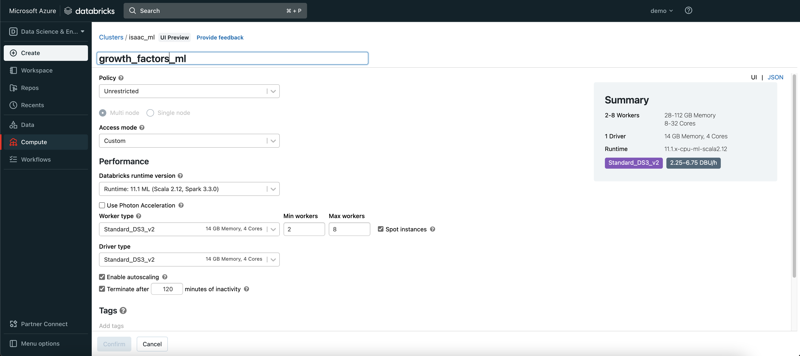
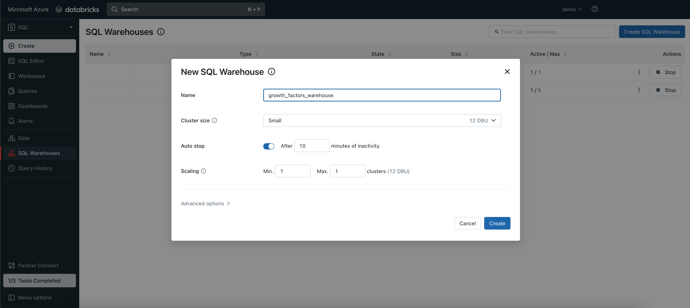
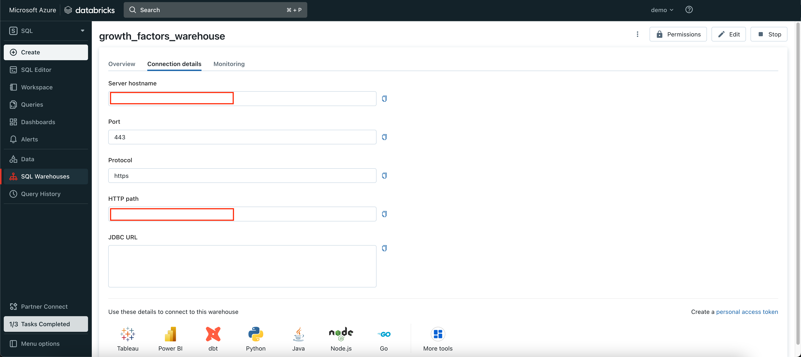
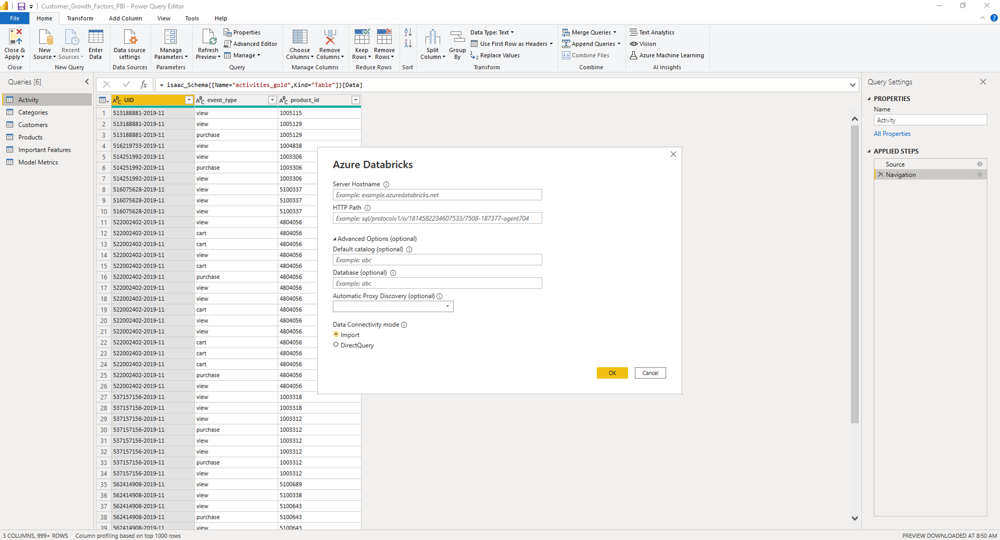
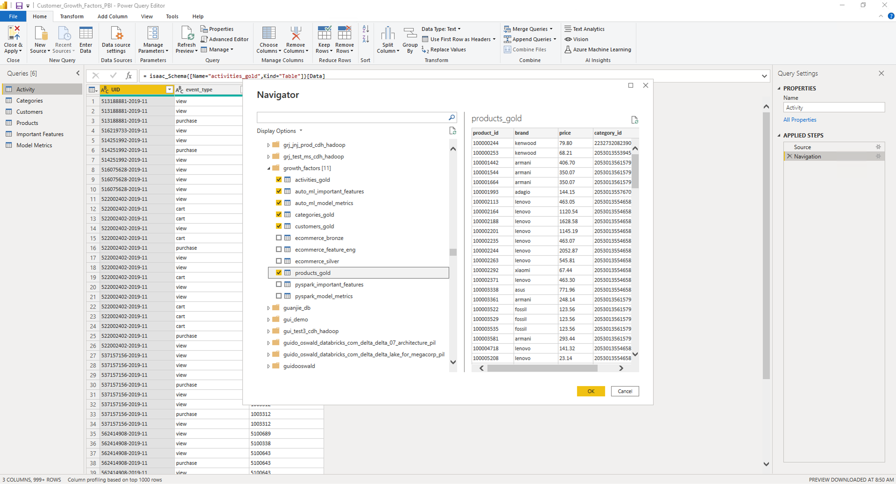
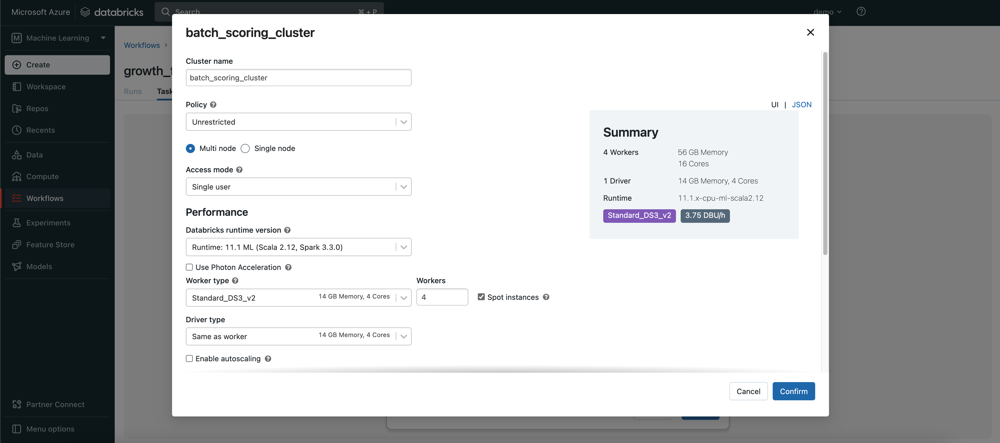
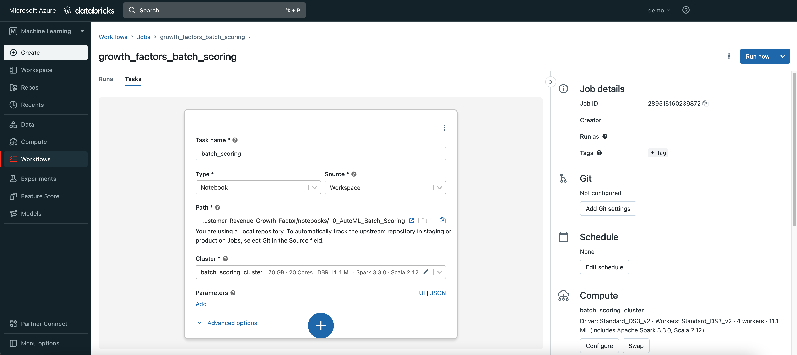

# Clone Repo
Follow these steps to clone the notebooks and Power BI report from GitHub

1. Navigate to the Repos tab
2. Click into your user folder > Right click > Add Repo
3. Set Git repository URL to: `https://github.com/microsoft/Azure-Databricks-Solution-Accelerator-Financial-Analytics-Customer-Revenue-Growth-Factor.git`
4. Click on Submit

# Create Clusters
We are going to create 2 clusters to use for this Solutions Accelerator.

1. Navigate to the compute tab.
2. Set up an ETL Cluster with the following parameters
  * Name: `growth_factors_etl`
  * Databricks Runtime Version: `11.1`
  * Use Photon Acceleration: `Checked`
  * Worker type: `Standard_L8s`
  * Min workers: `2`
  * Max workers: `8`
  * Spot instances: `Checked`
  * Worker type: `Standard_L8s`
  * Enable autoscaling: `Checked`
  * Terminate after: `120` minutes of inactivity
3. Set up an ML Cluster with the following parameters
  * Name: `growth_factors_ml`
  * Databricks Runtime Version: `11.1 ML`
  * Worker type: `Standard_L8s`
  * Min workers: `2`
  * Max workers: `8`
  * Spot instances: `Checked`
  * Worker type: `Standard_L8s`
  * Enable autoscaling: `Checked`
  * Terminate after: `120` minutes of inactivity

# Download Dataset
This solution accelerator uses an eCommerce dataset from Kaggle and Google Drive. 
1. In order to download the data you will need to sign up for an account on [kaggle.com](https://www.kaggle.com/).
2. Once you created an account, navigate to the account icon > Account tab > click on "Create New API Token" and copy the username and key generated. An alternative approach that does not involve creating a Kaggle account is listed in the Data_Extract notebook.
1. Navigate to the repo > config > Data_Extract and attach `growth_factors_ml` cluster.
2. Replace the values for kaggle_username and kaggle_key to the values you copied. If you don't want these values to be in plain text, you can follow [these instructions](https://learn.microsoft.com/en-us/azure/databricks/security/secrets/secret-scopes) to store these as encrypted secrets in a Databricks secrets scope.
3. Run the notebook to download data for the October 2019 - April 2020 eCommerce datasets and store this data in the ADLS Gen 2 account created with the workspace (dbfs).

# Notebooks
Now that the notebooks are cloned, let's walk through each run each of these notebooks. Navigate to the repo > notebooks folder.
1. `01_Ingestion_Raw_to_Bronze` - this notebook cleans the source data into a workable dataset for the solution accelerator and stores it as a Bronze Delta Lake table. Attach `growth_factors_etl` cluster and run this notebook.
2. `02_DE_Bronze_Silver` - this notebook transforms the Bronze data to capture relevant metrics for ML modeling. Attach `growth_factors_etl` cluster and run this notebook.
3. `03_ML_Feature_Engineering` - this notebook selects features that will be used in the ML model. Attach `growth_factors_ml` cluster and run this notebook.
4. `04_ML_Model_Building` - this notebook builds a Spark-based ML model to predict whether a customer will grow in revenue. Attach `growth_factors_ml` cluster and run this notebook.
5. `05_AutoML_and_Deployment` - this notebook walks you through how to develop and deploy an ML model without writing a single line of code. Follow the steps in this notebook.
6. `06_AutoML_Metrics` - this notebook captures the ML performance metrics and feature importances from the best AutoML run. Attach `growth_factors_ml` cluster and run this notebook.
7. `07_Data_Model_Silver_to_Gold` - this notebook models the data for reporting in Power BI. Attach `growth_factors_etl` cluster and run this notebook.
8. `08_AutoML_Data_Exploration` - this notebook will get generated automatically after following step 5.
9. `09_AutoML_Best_Experiment` - this notebook will get generated automatically after following step 5.
10. `10_AutoML_Batch_Scoring` - this notebook will get generated automatically after following step 5.

# Power BI Dashboard
A Power BI Report is included which visualizes the key business metrics as well as the ML model results. Click `Download` from [this page](../reports/Customer_Growth_Factors_PBI.pbix) to download the .pbix file to your local machine.

1. Navigate to Databricks SQL by clicking on the Persona Switcher in the Top Left > `SQL`
2. Navigate to `SQL Warehouses` and create a SQL Warehouse with these parameters:
  * Name: `growth_factors_warehouse`
  * luster size: `Small`
3. Click `Create`

1. Navigate to `SQL Warehouses` > `growth_factors_warehouse` > `Connection details`
2. Copy the Server hostname and HTTP path. You will need these to connect Power BI to Databricks SQL.

3. Open the Customer_Growth_Factors_PBI.pbix in Power BI Desktop.
4. Navigate to the Power Query Editor by clicking on `Transform Data`
5. Select `New Source` and search for `Azure Databricks`

6. Enter the `Server Hostname` and `HTTP Path` that you copied from Databricks SQL and click `OK`.

7. Search for `growth_factors` and select the following tables and click `OK`: 
  * `activities_gold`
  * `auto_ml_important_features`
  * `auto_ml_model_metrics`
  * `categories_gold`
  * `customers_gold`
  * `products_gold`
8. One by one, delete the existing tables and re-name the newly imported tables to the same name. This will make sure all visuals are pointed to the tables you created instead.
  * `activities_gold` --> `Activity`
  * `auto_ml_important_features` --> `Important Features`
  * `auto_ml_model_metrics` --> `Model Metrics`
  * `categories_gold` --> `Categories`
  * `customers_gold` --> `Customers`
  * `products_gold` --> `Products`

# Workflows
[Workflows](https://www.databricks.com/product/workflows) is the built-in orchestrator in Azure Databricks. Let's create a workflow to schedule the batch scoring notebook as a daily batch scoring job.
1. Navigate to Workflows > Jobs > `Create Job`

2. Create a Job with the following parameters:
  * Job Name: `growth_factors_batch_scoring`
  * Task Name: `batch_scoring`
  * Path: navigate to `/notebooks/10_AutoML_Batch_Scoring`
  * Cluster: 
    * Cluster name: `batch_scoring_cluster`
    * Databricks runtime version: `11.1 ML`
    * Workers: `4`
    * Spot instances: `Checked` 
3. Click `Run now` and navigate to the job run to see the results.

Congratulations! You set up an end-to-end Azure Databricks Lakehouse solution accelerator for identifying the key factors for revenue growth for an eCommerce platform.